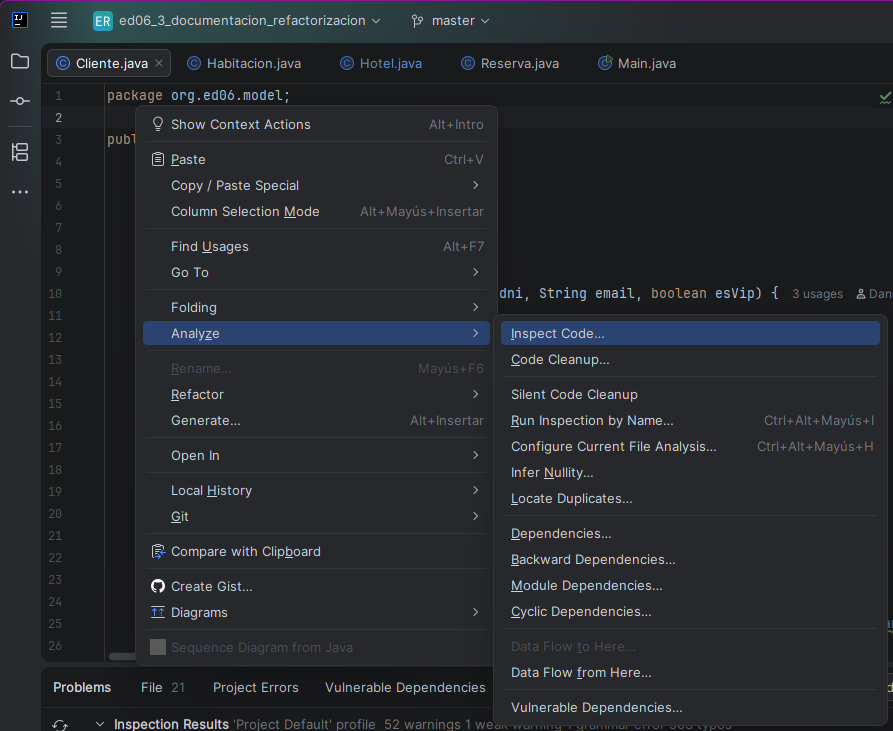
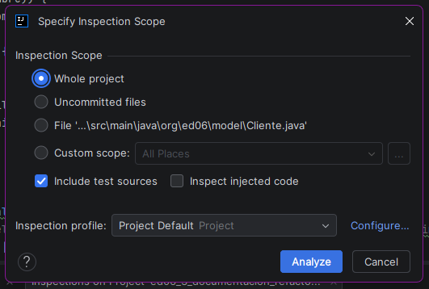
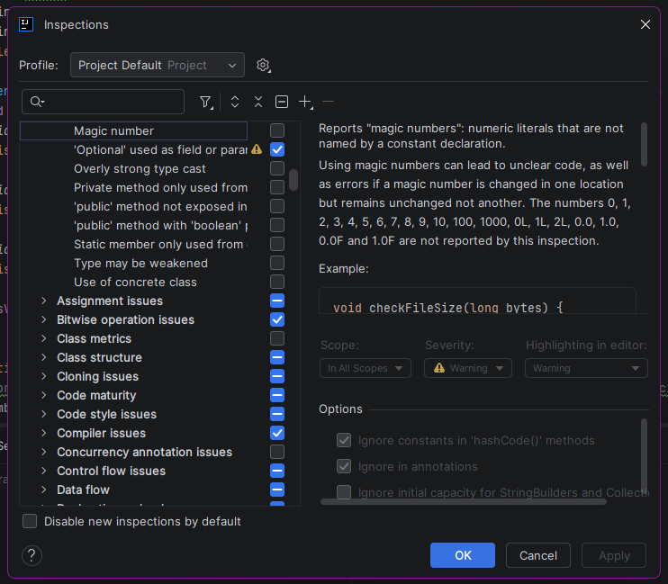
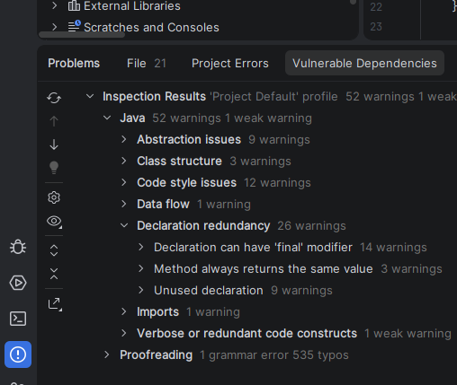
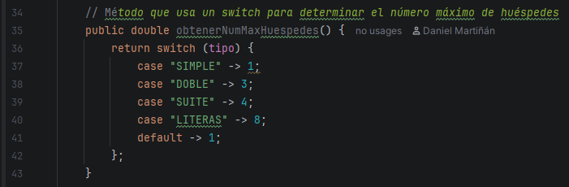

# Informe de la tarea

En el siguiente documento se describen todos los *code smells* detectados e identificados junto con su refactorización. Estos serán clasificados conforme al orden en el que se presentan en los apuntes de la asignatura.

## 1. Identificación de los code smells

Empezaremos a identificar los code smells siguiendo el orden siguiente:

1. Clase `Cliente`
2. Clase `Habitacion`
3. Clase `Hotel`
4. Clase `Reserva`
5. Clase `Main`

Para detectar los code smells haremos uso de la opción `Analyze > Inspect Code...` del menú asociado al click derecho del ratón.



Una vez seleccionada la opción, le saldrá la siguiente ventana. Deberá seleccionar la opción `Whole project` y pulsar con el ratón sobre `Configure...`.



Una vez haya pulsado sobre `Configure...`, le aparecerá la siguiente ventana. 



Deberá clickar sobre la barra de búsqueda para buscar *magic numbers* y seleccionará el ítem `Java/Abstraction issues/Magic Number`. Luego pulse el botón `Apply`y posteriormente el botón `OK` para guardar el cambio y regresar a la ventana anterior. Una vez vea la ventana anterior, pulse el botón `Analyze` para comenzar el análisis.


Una vez termine el análisis, obtendremos la información mostrada en la siguiente imagen. Dicha información nos será útil para detectar code smells en el código del proyecto.



### 1.1. Clase `Cliente`

En la clase `Cliente` se ha detectado un posible magic number en el método `validarNombre(String nombre)`: el número 3 en la condición de la sentencia `if`, que define el tamaño mínimo (sin espacios) que un nombre debe tener para ser válido.

```java
public static boolean validarNombre(String nombre) {
        // Comprobamos que el nombre no sea nulo, esté vacio y tenga al menos 3 caracteres eliminando espacios inciales y finales
        if (nombre == null || nombre.trim().length() < 3) {
            throw new IllegalArgumentException("El nombre no es válido");
        }
        return true;
    }
```

Por otra parte, se ha detectado varios *Primitive Obsessions* en los atributos de la clase. Los atributos afectados son `email` y `dni`. A pesar de que se realiza la validación en el constructor de la clase, estarían mejor modelados mediante una clase.

```java
public class Cliente {
    public int id;
    public String nombre;
    public String dni;
    public String email;
    public boolean esVip;
    
    public Cliente(int id, String nombre, String dni, String email, boolean esVip) {
        this.id = id;
        if(validarNombre(nombre)) {
            this.nombre = nombre;
        }
        if(validarDni(dni)) {
            this.dni = dni;
        }
        if(validarEmail(email)) {
            this.email = email;
        }
        this.esVip = esVip;
    }
    //...
}
```

Como podrá haber deducido, `nombre` también podría haber sido mencionado como un code smell, pero... ¿por qué no ha sido mencionado? Es muy simple. El atributo `nombre` no modela un concepto del mundo real, pues es una característica del cliente. Por tanto, no se considera.

### 1.2. Clase `Habitacion`

Se ha detectado un code smell de tipo Object-Oriented Abuser en la línea 36. El siguiente fragmento de código muestra un switch statement que indica que el código no está utilizando correctamente la herencia o el polimorfismo.

```java
// Método que usa un switch para determinar el número máximo de huéspedes
public double obtenerNumMaxHuespedes() {
    return switch (tipo) {
        case "SIMPLE" -> 1;
        case "DOBLE" -> 3;
        case "SUITE" -> 4;
        case "LITERAS" -> 8;
        default -> 1;
    };
}
```

Además, este método no se utiliza nunca, tal y como se puede ver en la imagen siguiente (está marcado con `no usages`).



Finalmente, tenemos el método `reservar()`, cuyo aspecto es un tanto sospechoso. Sion embargo, en el mismo código hay un comentario que nos indica que la forma de festionar la disponibilidad de una habitación está pendiente de modificaciones. Por ahora, no vamos a considerar acciones sobre dicho método.

```java
public void reservar() {
    if (disponible) {
        System.out.println("Habitación #" + numero + " ya reservada");
    }
    disponible = true;
}
```

## 1.3. Clase `Hotel`

## 1.4. Clase `Reserva`

## 1.5. Clase `Main`
