# Informe de la tarea

En el siguiente documento se describen todos los *code smells* detectados e identificados junto con su refactorización. Estos serán clasificados conforme al orden en el que se presentan en los apuntes de la asignatura.

Empezaremos a identificar los code smells siguiendo el orden siguiente:

1. Clase `Hotel`
2. Clase `Reserva`
3. Clase `Habitacion`
4. Clase `Cliente`
5. Clase `Main`

## Inspección del proyecto con IntelliJ IDEA

Para detectar los code smells haremos uso de la opción `Analyze > Inspect Code...` del menú asociado al click derecho del ratón.


Una vez seleccionada la opción, le saldrá la siguiente ventana. Deberá seleccionar la opción `Whole project` y pulsar con el ratón sobre `Configure...`.


Una vez haya pulsado sobre `Configure...`, le aparecerá la siguiente ventana. 


Deberá clickar sobre la barra de búsqueda para buscar *magic numbers* y seleccionará el ítem `Magic Number`. Luego pulse el botón `Apply`y posteriormente el botón `OK` para guardar el cambio y regresar a la ventana anterior. Una vez vea la ventana anterior, pulse el botón `Analyze` para comenzar el análisis.

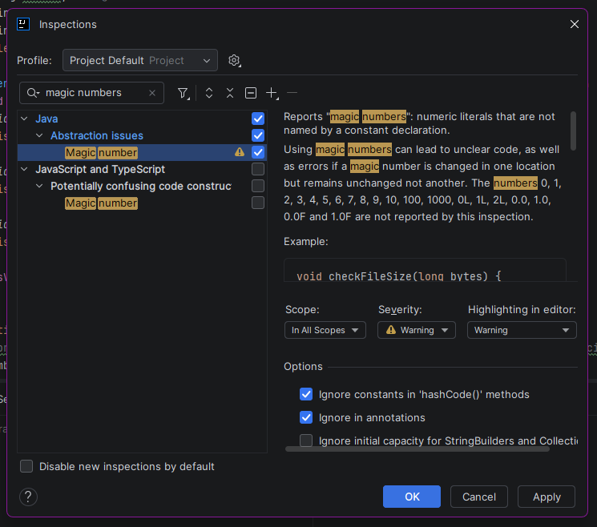

> [!NOTE]
> El ejemplo del ítem `Magic Number` es aplicable a otros ítems, tales como `Feature envy`, `'switch' statement`. Estos últimos también se usarán en la realización de esta tarea.

Una vez termine el análisis, obtendremos la información mostrada en la siguiente imagen. Dicha información nos será útil para detectar code smells en el código del proyecto.


## 1. Clase `Cliente`

### Visibilidad de los atributos

Los atributos de la clase son públicos. Hay que cambiar su visibilidad a privado para cumplir con los estándares del **Clean Code** y los principios de la encapsulación, y añadir el getter correspondiente con modificador `public`.

- **Antes de refactorizar:**

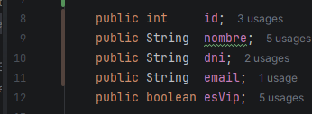

- **Refactorización:** la refactorización debe realizarse atributo a atributo.

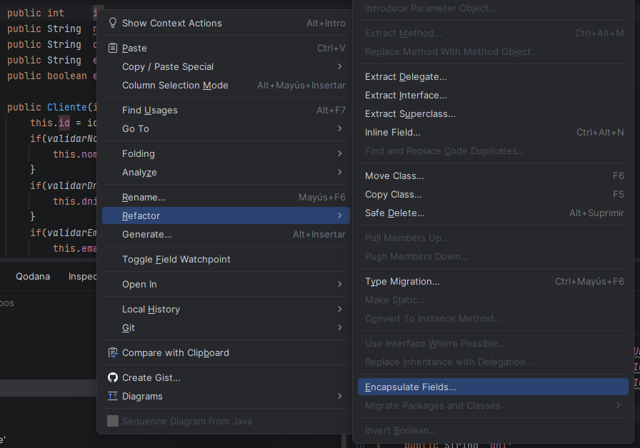

Le saldrá la siguiente ventana. Marcamos todos los atributos públicos (menos `esVip`) y generamos únicamente la opción del `Get access`. Luego pulsaremos el botón `Refactor`.

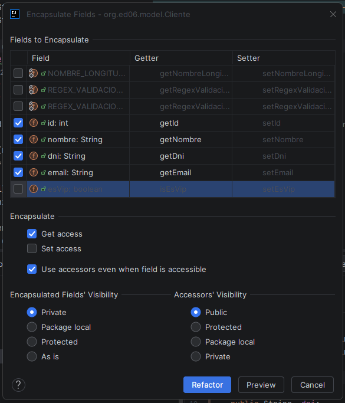

Para el caso del atributo `esVip` será necesario crear también su setter.

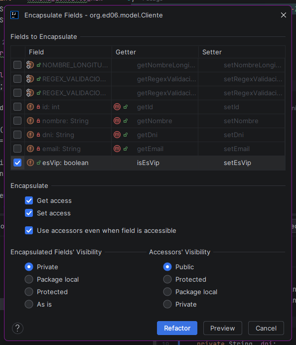

- **Después de refactorizar:**

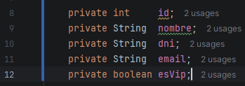

Se muestra a continuación el código generado al refactorizar.

```java
public int getId() { 
    return id;
}
public String getNombre() {
    return nombre;
}
public String getDni() {
    return dni;
}
public String getEmail() {
    return email;
}
public boolean isEsVip() {
    return esVip;
}
public void setEsVip(boolean esVip) {
    this.esVip = esVip;
}
```

### Magic numbers

Se ha detectado un magic number en el método `validarNombre`: el número 3 en la condición de la sentencia `if`, que define el tamaño mínimo (sin espacios) que un nombre debe tener para ser válido.

- **Antes de refactorizar:**

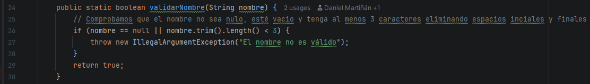

- **Refactorización:**

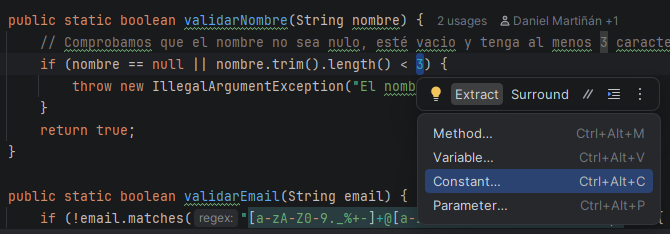

- **Después de refactorizar:**

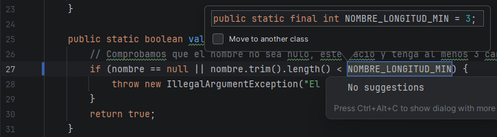

Si vamos a lod métodoe `validarEmail` y `validarDni`, encontramos una cadena de texto utilizada para validar el email y el DNI (respectivamente) del cliente que podemos considerar *magic numbers*. Procedemos a extraerlas como constantes al igual que antes.

- **Antes de refactorizar:**

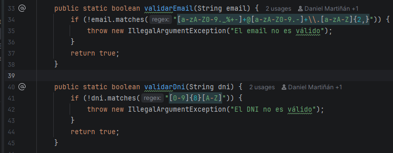

- **Refactorización:**

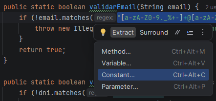
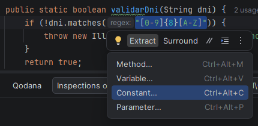

- **Después de refactorizar:**

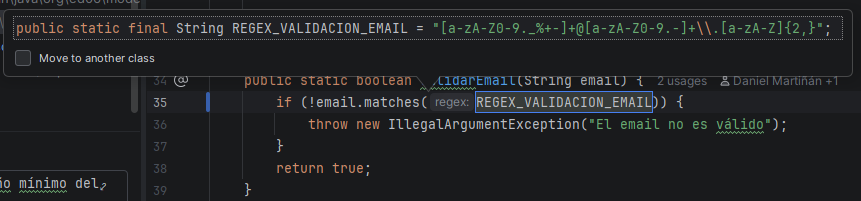
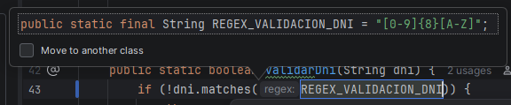

### Eliminando redundancias

El constructor de la clase `Cliente` es el siguiente:

```java
public Cliente(int id, String nombre, String dni, String email, boolean esVip) {
    this.id = id;
    if(validarNombre(nombre)) {
        this.nombre = nombre;
    }
    if(validarDni(dni)) {
        this.dni = dni;
    }
    if(validarEmail(email)) {
        this.email = email;
    }
    this.setEsVip(esVip);
}
```

Si echamos un vistazo al código, podemos ver que los tres métodos de validación solo pueden hacer una de dos cosas:

- Devolver `true` si el dato es válido
- Lanzar una excepción informando al usuario de que el dato no es válido

En resumen, resulta redundante encerrar la llamada al método en la condición de una sentencia `if`, pues lo que haya después de la ejecución de la llamada se ejecutará si y sólo si el dato es válido. Por tanto, se elimina dicha redundancia, siendo el siguiente fragmento el código refactorizado.

```java
public Cliente(int id, String nombre, String dni, String email, boolean esVip) {
    this.id = id;
    validarNombre(nombre);
    this.nombre = nombre;
    validarDni(dni);
    this.dni = dni;
    validarEmail(email);
    this.email = email;
    this.setEsVip(esVip);
}
```

## 2. Clase `Reserva`

### Método `calcularPrecioFinal()`

#### Nombre de variables

Se detectan varias variables con nombres ilegibles y poco o nada descriptivos.

- **Antes de refactorizar:**

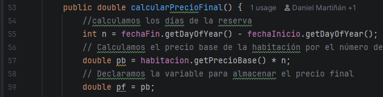

- **Refactorización:** Cambiamos el nombre de las variables a uno más legible y autodescriptivo.

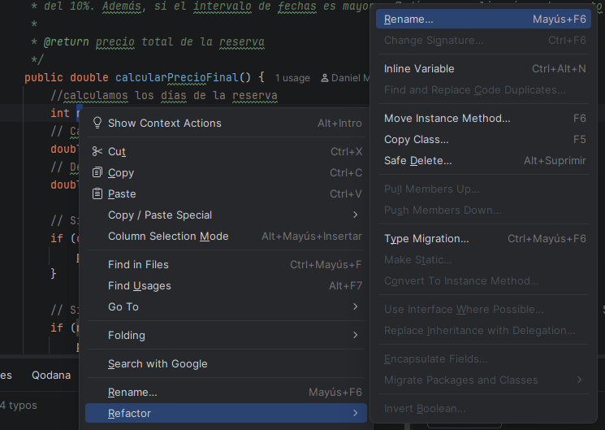

- **Después de refactorizar:**

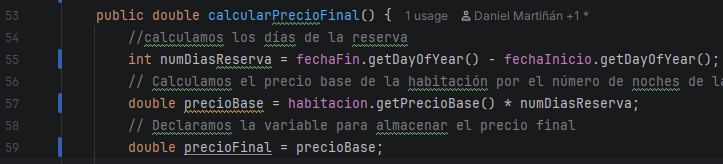

#### Comentarios

Se detecta un comentario demasiado largo.

- **Antes de refactorizar:**

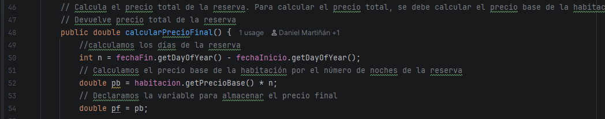

- **Refactorización:** Lo convertimos a comentario Javadoc e insertaremos algunos saltos de línea para facilitar la legibilidad.

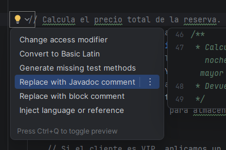

- **Después de refactorizar:**

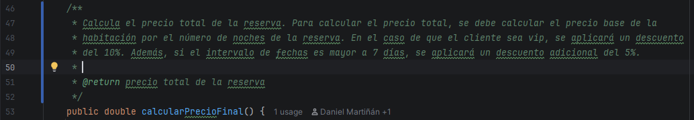

También se detectan algunos comentarios redundantes, por lo que se procede a eliminarlos.

- **Antes de refactorizar:**

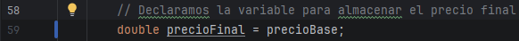
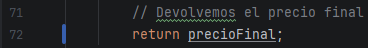

- **Refactorización:** Se eliminan los comentarios.
- **Después de refactorizar:**

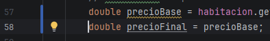
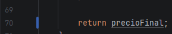

#### Feature envy

Se detectan dos feature envys al aplicar descuentos. Se extraen ambas, ubicando el cálculo del descuento VIP en la clase `Cliente` y el cálculo del descuento adicional en la clase `Reserva`.

- **Antes de refactorizar:**

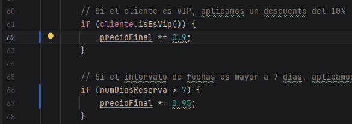

- **Refactorización:** primero extraeremos el método y luego lo ubicaremos en la clase correspondiente.
  - `Cliente`:

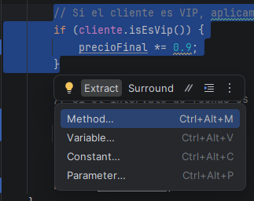
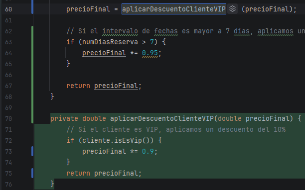

Ahora lo movemos a la clase correcta:

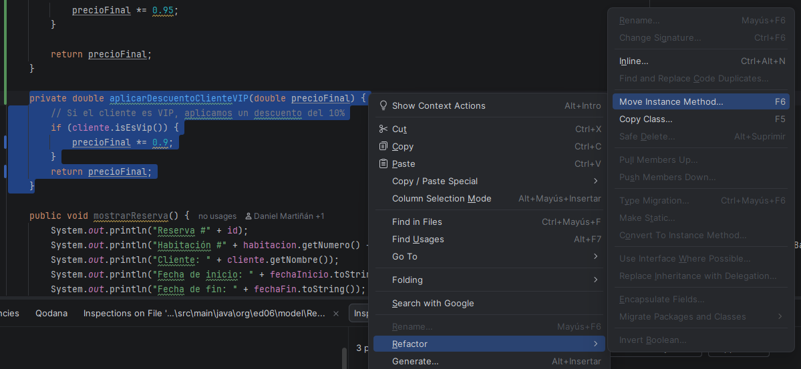

El método quedará como sigue, pero hace falta refactorizar un poco más:

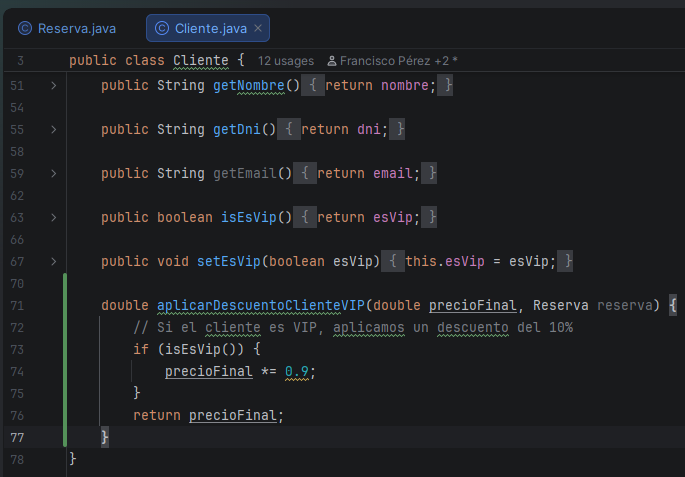

Debemos eliminar el parámetro `reserva`, que no sirve para nada, y resolver el magic number.

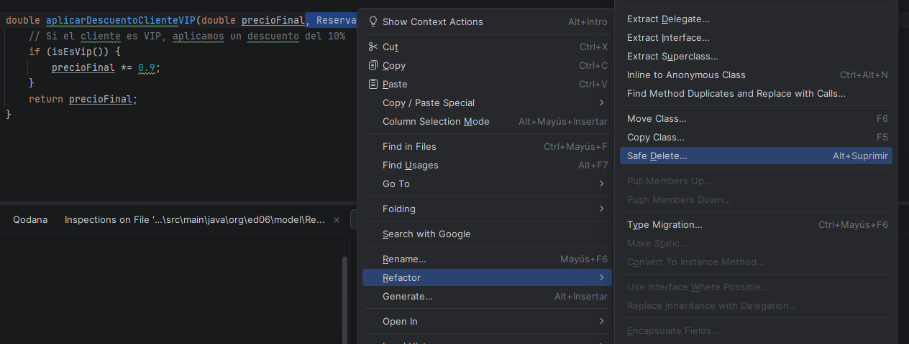
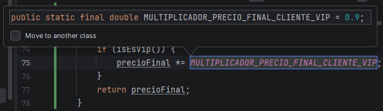

El método refactorizado queda como sigue:

```java
double aplicarDescuentoClienteVIP(double precioFinal) {
    // Si el cliente es VIP, aplicamos un descuento del 10%
    if (isEsVip()) {
        precioFinal *= MULTIPLICADOR_PRECIO_FINAL_CLIENTE_VIP;
    }
    return precioFinal;
}
```

  - `Reserva`: pasamos a realizar el mismo proceso con la segunda feature envy.

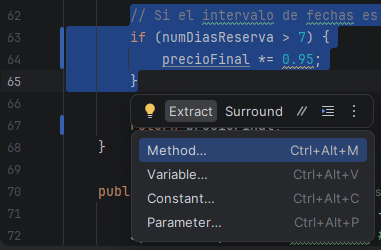
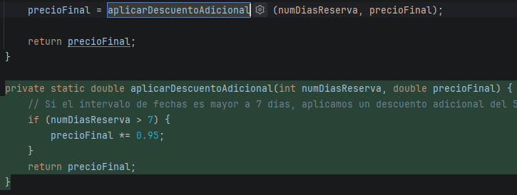

El método quedará como sigue, pero hace falta refactorizar un poco más:

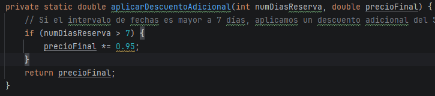

Debemos resolver los magic number.

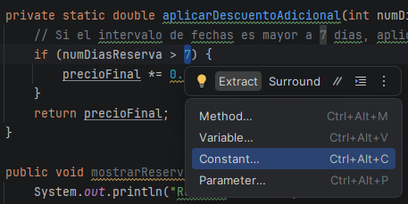
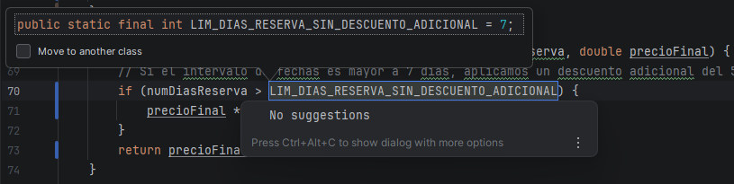
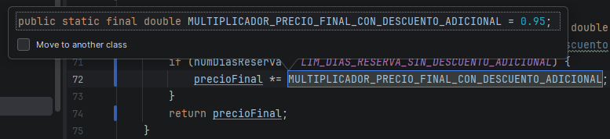

El método refactorizado queda como sigue:

```java
private static double aplicarDescuentoAdicional(int numDiasReserva, double precioFinal) {
    // Si el intervalo de fechas es mayor a 7 días, aplicamos un descuento adicional del 5%
    if (numDiasReserva > LIM_DIAS_RESERVA_SIN_DESCUENTO_ADICIONAL) {
        precioFinal *= MULTIPLICADOR_PRECIO_FINAL_CON_DESCUENTO_ADICIONAL;
    }
    return precioFinal;
}
```

#### Variable redundante

Se detecta que la variable `precioBase` es redundante. Se procede a refactorizarla.

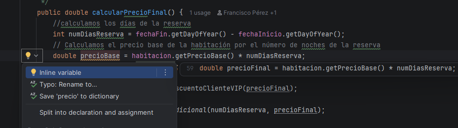
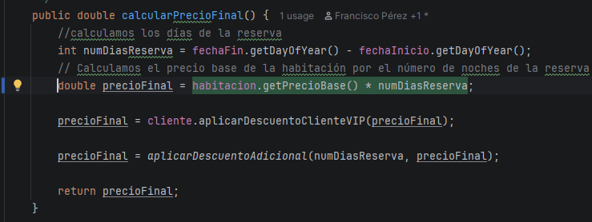

### Método `mostrarReserva()`

#### Feature envy

En este método se detectan varias feature envys a resolver.

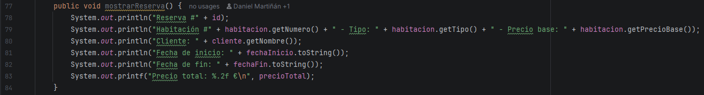

Primero. extraemos el `println` de la habitación:

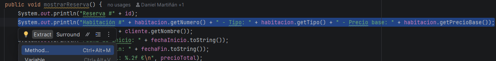
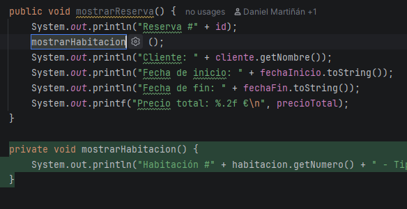
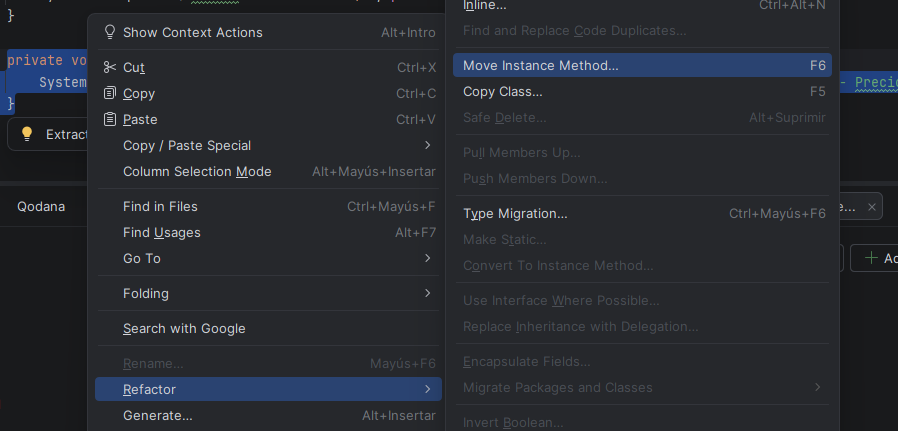
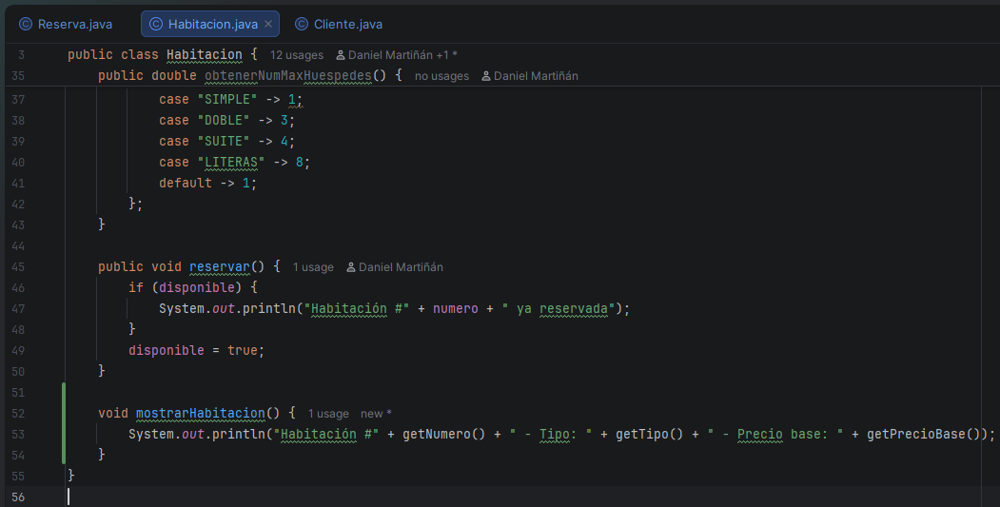

Primero. extraemos el `println` de la habitación:

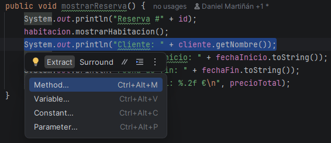
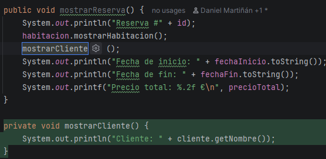
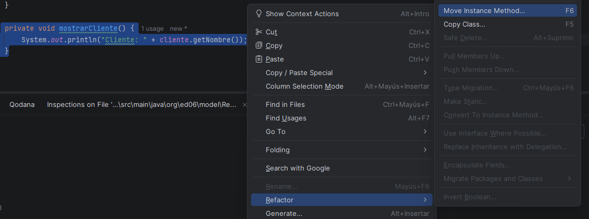
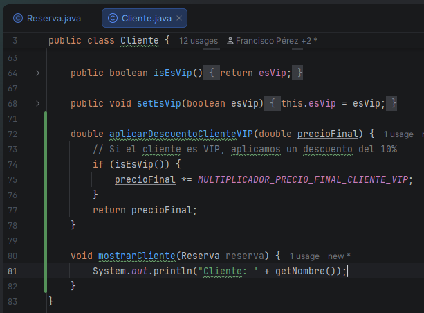

Es necesario eliminar el parámetro `reserva`, pues no cumple ningún rol.

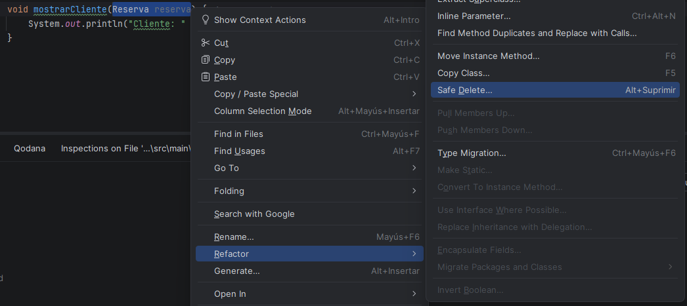
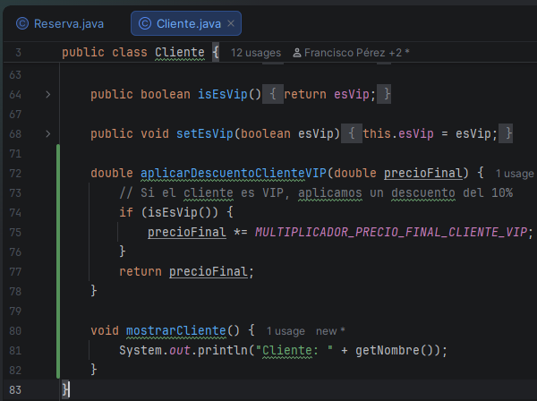

#### Eliminando redundancias

Al imprimir las fechas de inicio y fin se usa el método `toString()`, pero este método se puede eliminar dado que `println` invoca al método `toString()` de los objetos que recibe por defecto.

- **Antes de refactorizar:**


- **Después de refactorizar:**


### Dead Code

En la clase se detectan varios métodos que nunca se utilizan, pero se asume que han sido implementados como deuda técnica a futuro.

## 3. Clase `Habitacion`

### Object-Oriented Abuser: `switch` statement

Se ha detectado un code smell de tipo Object-Oriented Abuser en la línea 36. El siguiente fragmento de código muestra un `switch` statement que indica que el código no está utilizando correctamente la herencia o el polimorfismo.

```java
// Método que usa un switch para determinar el número máximo de huéspedes
public double obtenerNumMaxHuespedes() {
    return switch (tipo) {
        case "SIMPLE" -> 1;
        case "DOBLE" -> 3;
        case "SUITE" -> 4;
        case "LITERAS" -> 8;
        default -> 1;
    };
}
```

Además, este método no se utiliza nunca, tal y como se puede ver en la imagen siguiente (está marcado con `no usages`).


Esto viene acompañado de otro code smell: el **primitive obsession**, pues el tipo de habitación se está modelando con un `String`. Basándonos en que el método no se utiliza, simplemente lo eliminaremos y listo.

### Método `reservar()`

El método `reservar()` tiene aspecto es un tanto sospechoso. Sin embargo, en el mismo código hay un comentario que nos indica que la forma de gestionar la disponibilidad de una habitación está pendiente de modificaciones. Por ahora, no vamos a considerar acciones sobre dicho método.

```java
public void reservar() {
    if (disponible) {
        System.out.println("Habitación #" + numero + " ya reservada");
    }
    disponible = true;
}
```

## 4. Clase `Hotel`

### Código inalcanzable

El IDE, nada más abrir el archivo `Hotel.java`, nos indica que hay un error en la línea 112 debido a un `Unreachable statement`. El propio IDE nos indica que el `return 0;` es inalcanzable, por lo que se procede a su eliminación.

- **Antes de refactorizar:**


- **Después de refactorizar:**


A mayores, se detecta que el método mostrado a continuación no es utilizado. En este caso optamos por dejarlo, asumiendo que se trata de una deuda técnica a futuro, es decir, asumiendo que se trata de una funcionalidad del programa que no se ha terminado de integrar al software.

```java
public void registrarHabitaciones(List<String> tipos, List<Double> preciosBase) {
    for(int i = 0; i < tipos.size(); i++) {
        Habitacion habitacion = new Habitacion(habitaciones.size() + 1, tipos.get(i), preciosBase.get(i));
        habitaciones.add(habitacion);
        reservasPorHabitacion.put(habitacion.getNumero(), new ArrayList<>());
    }
}
```

### Duplicación de código

Analizando más en detalle el método `registrarHabitaciones(List<String> tipos, List<Double> preciosBase)`, nos damos cuenta que el contenido del bucle `for` está duplicado, pues equivale al método `registrarHabitacion(String tipo, double precioBase)`.

- **Antes de refactorizar:**


- **Refactorización:** reescritura a mano.
- **Después de refactorizar:**


Por otra parte, en el método `listarHabitacionesDisponibles()` tenemos que el contenido dentro de la sentencia `if` se corresponde con el contenido del método `mostrarHabitacion` que obtuvimos como resultado de una refactorización previa. Por tanto, sustituimos dicha línea por la llamada la método y listo.

- **Antes de refactorizar:**


- **Después de refactorizar:**


### Método `listarReservas()`

En este método vemos claramente un feature envy, por lo que para solucionarlo extraeremos el método y luego lo moveremos a la clase `Reserva`.

- **Antes de refactorizar:**


- **Refactorización:** Usando el atajo de teclado `Ctrl+Alt+Shift+T` accedemos a la opción `Refactor This...`: 


Ahora borramos la palabra clave `static` y lo movemos a la clase `Reserva`.


Para finalizar, podemos renombrar el método a `toString()` y marcamos el método con el `@Override`, obteniendo el método refactorizado.


- **Después de refactorizar:**


### Método `listarClientes()`

En este método vemos claramente un feature envy, por lo que para solucionarlo extraeremos el método y luego lo moveremos a la clase `Cliente`.

- **Antes de refactorizar:**


- **Refactorización:** Usando el atajo de teclado `Ctrl+Alt+Shift+T` accedemos a la opción `Refactor This...`: 


Ahora borramos la palabra clave `static` y lo movemos a la clase `Reserva`.


- **Después de refactorizar:**


### Método `reservarHabitacion`

Echando un vistazo al código, podemos ver varios code smells. Uno de ellos, el más rápido de identificar, es el tamaño del método.

#### Comentarios

El primer comentario deeb ser transformado a un comentario de Javadoc.


También se detectan varios comentarios redundantes que se eliminarán. Son un total de 4 comentarios que no se documentarán por motivos de tiempo.

#### Early return

El método consta de varias sentencias `if` anidadas, de las cuales las 3 primeras se pueden invertir, aplicando así el `Early return`.

- **Antes de refactorizar:**


- **Refactorización:** Se aplica el mismo método a los 3 primeros `if` del método.


Al aplicar el cambio, se mantiene la cláusula `else`. Para eliminar los `else` redundantes, procedemos aplicando la opción mostrada a continuación.


- **Después de refactorizar:**


#### Extracción de métodos

Hay dos fragmentos del método que podemos extraer, creando un nuevo método.

- **Antes de refactorizar:**


- **Refactorización:**


- **Después de refactorizar:**


Estos dos métodos contienen cada uno un encadenamiento de llamadas, pero en esta clase tiene sentido que se encadenen algunas operaciones, por lo que se dejan como están.

## 5. Clase `Main`

### Carga de datos

Nada más entrar en el método `main()` podemos ver que se registran algunas habitaciones y algunos clientes. Vamos a extraer ambos fragentos para posicionarlos en la clase `Hotel`, evitando así el encadenamiento de llamadas.

- **Antes de refactorizar:**


- **Refactorización:**


Procedemos a mover el método extraído a la clase `Hotel`:


- **Después de refactorizar:**


### Operaciones del menú

Podemos ver que en cada sentencia `case` del método `main()` están todas las operaciones "a pelo", en lugar de estar separadas en métodos. Procedemos a extraerlas a métodos y reubicarlas si es necesario.

#### Opción *Registrar habitación*

- **Antes de refactorizar:**


- **Refactorización:**


- **Después de refactorizar:**


#### Opción *Reservar habitación*

- **Antes de refactorizar:**


- **Después de refactorizar:**


Se puede seguir refactorizando, extrayendo la construcción de la fecha de entrada a un método externo.


Al refactrorizar, el propio IDE nos sugiere crear un método común para las dos peticiones de fecha (la de entrada y la de salida), por lo que la aceptamos.


Nos genera el siguiente código:

```java
private static LocalDate pedirFecha(String x, String x1, String x2) {
    System.out.println(x);
    int anioEntrada = scanner.nextInt();
    scanner.nextLine();

    System.out.println(x1);
    int mesEntrada = scanner.nextInt();
    scanner.nextLine();

    System.out.println(x2);
    int diaEntrada = scanner.nextInt();
    scanner.nextLine();

    LocalDate fechaEntrada = LocalDate.of(anioEntrada, mesEntrada, diaEntrada);
    return fechaEntrada;
}
```

Renombraremos parámetros y variables con la opción `Reformat > Reanme...`, obteniendo el siguiente código:


Si nos damos cienta, la variable `fecha` es redundante, por lo que también la refactorizamos.


Nos queda como código final el siguiente:

```java
private static void reservarHabitacion(Hotel hotel) {
    String tipo;
    System.out.println("Introduce el id del cliente: ");
    int clienteId = scanner.nextInt();

    System.out.println("Introduce el tipo de habitación (SIMPLE, DOBLE, SUITE): ");
    tipo = scanner.next();

    LocalDate fechaEntrada = pedirFecha(
        "Introduce la fecha de entrada (año): ",
        "Introduce la fecha de entrada (mes): ",
        "Introduce la fecha de entrada (día): ");

    LocalDate fechaSalida = pedirFecha(
        "Introduce la fecha de salida (año): ",
        "Introduce la fecha de salida (mes): ",
        "Introduce la fecha de salida (día): ");

    int numeroHabitacion = hotel.reservarHabitacion(clienteId, tipo, fechaEntrada,
        fechaSalida);
    System.out.println("Datos de la habitacion");
    Habitacion habitacion = hotel.getHabitacion(numeroHabitacion);
    System.out.println(
        "Habitación #" + habitacion.getNumero() + " - Tipo: " + habitacion.getTipo()
        + " - Precio base: " + habitacion.getPrecioBase());
    System.out.println("Número de habitación reservada: " + numeroHabitacion);
}

private static LocalDate pedirFecha(String peticionAnio, String peticionMes, String peticionDia) {
    System.out.println(peticionAnio);
    int anio = scanner.nextInt();
    scanner.nextLine();

    System.out.println(peticionMes);
    int mes = scanner.nextInt();
    scanner.nextLine();

    System.out.println(peticionDia);
    int dia = scanner.nextInt();
    scanner.nextLine();

    return LocalDate.of(anio, mes, dia);
}
```

#### Opción *Registrar cliente*

- **Antes de refactorizar:** Se copia directamente el código fuente debido a la extensión de la operación:

```java
String nombre;
String email;
String dni;

while(true) {
    try {
        System.out.println("Introduce el nombre del cliente: ");
        nombre = scanner.next();
        Cliente.validarNombre(nombre);
        break;
    } catch (IllegalArgumentException e) {
        System.out.println("Nombre no válido. Inténtalo de nuevo.");
    }
}
while (true) {
    try {
        System.out.println("Introduce el email del cliente: ");
        email = scanner.next();
        Cliente.validarEmail(email);
        break;
    } catch (IllegalArgumentException e) {
        System.out.println("Email no válido. Inténtalo de nuevo.");
    }
}
while (true) {
    try {
        System.out.println("Introduce el DNI del cliente: ");
        dni = scanner.next();
        Cliente.validarDni(dni);
        break;
    } catch (IllegalArgumentException e) {
        System.out.println("DNI no válido. Inténtalo de nuevo.");
    }
}
System.out.println("¿Es VIP? (true/false): ");
boolean esVip = scanner.nextBoolean();
hotel.registrarCliente(nombre, email, dni, esVip);
```


Este nuevo método puede refactorizarse en métodos más pequeños, pues es demasiado largo.


Finalmente, se unen la declaración de la variable con la asignación.


- **Después de refactorizar:** Se muestran los métodos resultantes.

```java
private static void registrarCliente(Hotel hotel) {
    String nombre = pedirNombre();
    String email = pedirEmail();
    String dni = pedirDni();
    System.out.println("¿Es VIP? (true/false): ");
    boolean esVip = scanner.nextBoolean();
    hotel.registrarCliente(nombre, email, dni, esVip);
}

private static String pedirDni() {
    String dni;
    while (true) {
        try {
            System.out.println("Introduce el DNI del cliente: ");
            dni = scanner.next();
            Cliente.validarDni(dni);
            break;
        } catch (IllegalArgumentException e) {
            System.out.println("DNI no válido. Inténtalo de nuevo.");
        }
    }
    return dni;
}

private static String pedirEmail() {
    String email;
    while (true) {
        try {
            System.out.println("Introduce el email del cliente: ");
            email = scanner.next();
            Cliente.validarEmail(email);
            break;
        } catch (IllegalArgumentException e) {
            System.out.println("Email no válido. Inténtalo de nuevo.");
        }
    }
    return email;
}

private static String pedirNombre() {
    String nombre;
    while(true) {
        try {
            System.out.println("Introduce el nombre del cliente: ");
            nombre = scanner.next();
            Cliente.validarNombre(nombre);
            break;
        } catch (IllegalArgumentException e) {
            System.out.println("Nombre no válido. Inténtalo de nuevo.");
        }
    }
    return nombre;
}
```

#### Opción *Salir*

- **Antes de refactorizar:**


- **Después de refactorizar:**


### Dead Code

La variable `tipo` que aparece al principio del método `main` no se utiliza, por lo que se procede a borrarla.


### Switch statement

Normalmente esto es un code smell, pero en este caso es necesario mantenerlo. Si embargo, vamos a sustituirlo por su versión mejorada:


